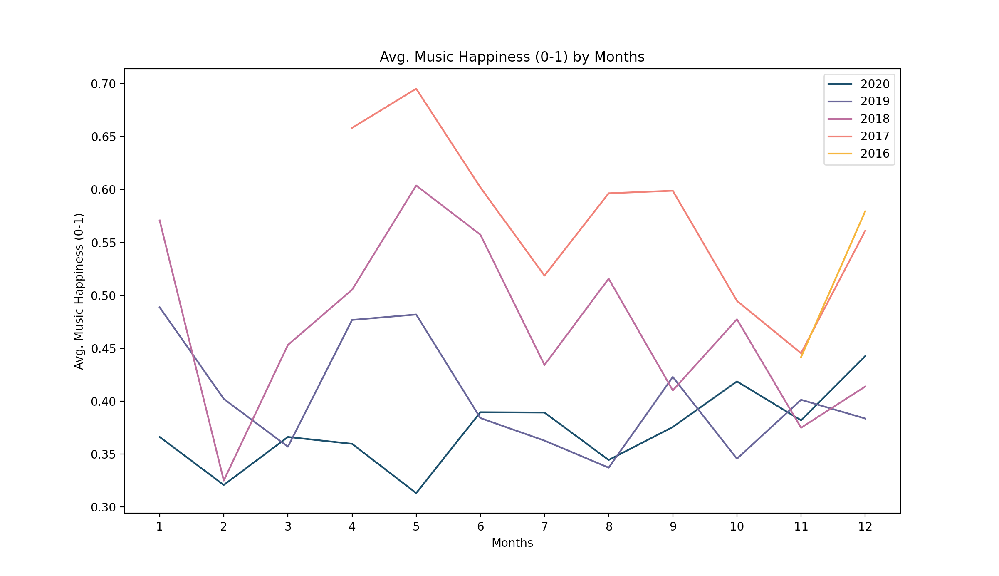

# MoodTrack

Description: 

 Using Spotipy, a Python library for the Spotify API, MoodTrack generates a graph that shows how a user's mood has changed over time based on their listening history.
 Spotify has an awesome feature which lets you grab audio analysis for any track. 
 Features such as valence, danceability, and energy are all accessible
(Read more here: https://developer.spotify.com/documentation/web-api/reference/tracks/get-audio-features/).
 For MoodTrack, I grabbed the valence of each track, which is a value from 0.0 to 1.0 based on how positive the song sounds.
 Combining the valences of every song added to any playlist created in the last 5 years, I calculated a monthly average valence, which was used to track mood over time.

Requirements:

 1. Spotipy Library (pip install spotipy --upgrade)
 2. Numpy (pip install numpy)
 3. MatPlotLib (pip install matplotlib)

Running the Program:
 1. You will need your Spotify username, which is the text after '/user/' in https://open.spotify.com/user/.
  * This is your profile link which can be copied through the 'Share' button on your Spotify profile.
 2. You will need the Client Secret, which is a unique ID for the application. I currently haven't found a way to let others use the application without revealing my Client Secret ID.
